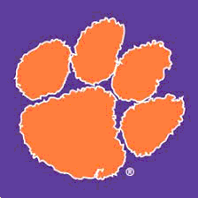
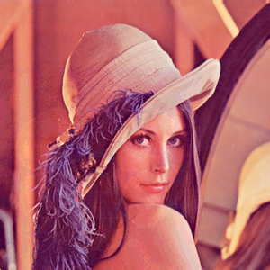
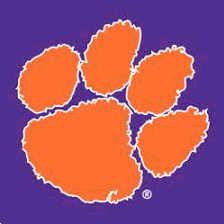
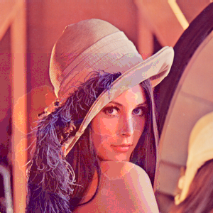
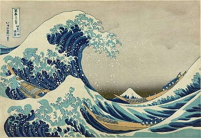
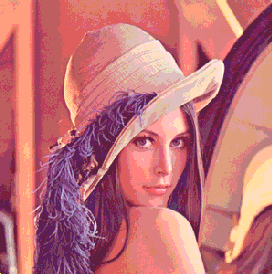
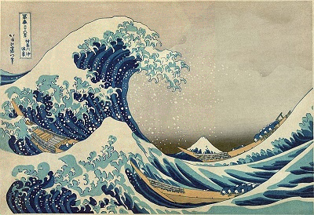
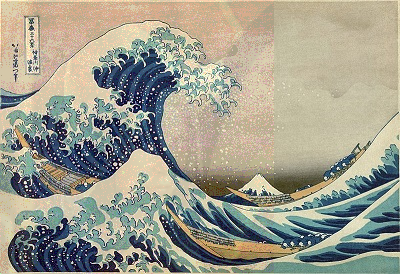
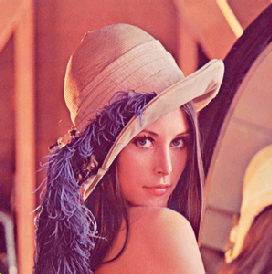
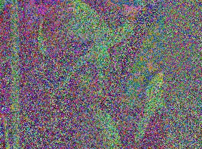

# Steganography (Image Hiding Tool)

## **Introduction**
> [Steganography][1] is the practice of concealing a file, message, image, or video within another file, message, image, or video.

The project is about a steganography tool that allows the user to hide an image inside another one, and also extract a hidden image from a merged image.

## Method
Each color channel of one pixel contains an 8-bit value, and the range is 0 - 255. The
leftmost bit is the most significant bit and there will be a large impact on the final value if we change it. On the other hand, the rightmost is the least significant bit and there will be less impact on the final value if we change it.

Based on above observation, we can replace the less significant bits from an image with
more significant bits from the other image. An example of hiding Image 2 into Image 1 is
given below:

| Pixel | from Image 1 |
|---------|----------|
| R | 11001011 |
| G | 00110001 |
| B | 10100010 |

| Pixel | from Image 2 |
|---------|----------|
| R | 00010000 |
| G | 10011001 |
| B | 11011010 |

| New | Pixel |
|---------|----------|
| R | 11000001 |
| G | 00111001 |
| B | 10101101 |

## **How to Use**
### **Dependencies**
Make sure that you have already installed the libraries below before you go to next step.
- OpenGL
- OpenImageIO

### **Compilation**
Open a terminal at the project folder, and type `make `. It will automatically compile the source code and generate an executable file named `imghide.out`.

### **Run**
Run the program with one image file, i.e., `./imghide.out Lenna.png`.

### **Commands**
The program accepts the following keys.

| Key | Function |
|:--------:| -------- |
| 'H' or 'h' | Hide one image inside the current image (need to know the filename and the number of bits). |
| 'E' or 'e' | Extract the hidden image from the current image (need to know the number of bits used for hiding). |
| 'R' or 'r' | Revert to the initial image. |
| 'W' or 'w' | Save the current displayed image to the disk. |
| 'Q' or 'q' or Esc | Quit the program. |

## **Results**
Here are two images, and their dimensions are 300\*300 and 225\*225 respectively. We are going to hide the right image inside the left one.

| Lenna | Clemson Tiger |
|-------------|--------|
| |  |

### **Use 3 bits**

| Merged Image | Extracted Image |
|:------------:|:---------------:|
|  |  |

### **Use 4 bits**

| Merged Image | Extracted Image |
|:------------:|:---------------:|
|  |  |

### **Use 5 bits**

| Merged Image | Extracted Image |
|:------------:|:---------------:|
|  |  |

What if the dimension of the image to hide is larger than the cover image?
we now have a new cover image shown below whose dimension is 400\*274, and we want to hide the above Lenna image inside it. The program will rescale the hidden image to fit into the cover image (the dimension of Lenna image should be 274\*274), and then use the previous technique.

| Waves |
|:-----:|
|  |

### **Use 3 bits**

| Merged Image | Extracted Image |
|:------------:|:---------------:|
|  |  |

### **Use 4 bits**

| Merged Image | Extracted Image |
|:------------:|:---------------:|
|  |  |

### **Use 5 bits**

| Merged Image | Extracted Image |
|:------------:|:---------------:|
|  |  |

The program works as expected when the cover image contains complex colors and the user uses less than or equal to 4 bits to conceal the image.

## Known Issues
The program can work well only with the lossless formats, e.g., PNG, BMP. If we use a lossy format to save the merged image, the extracted image would become a mess. An example is given below.

[1]: https://en.wikipedia.org/wiki/Steganography
